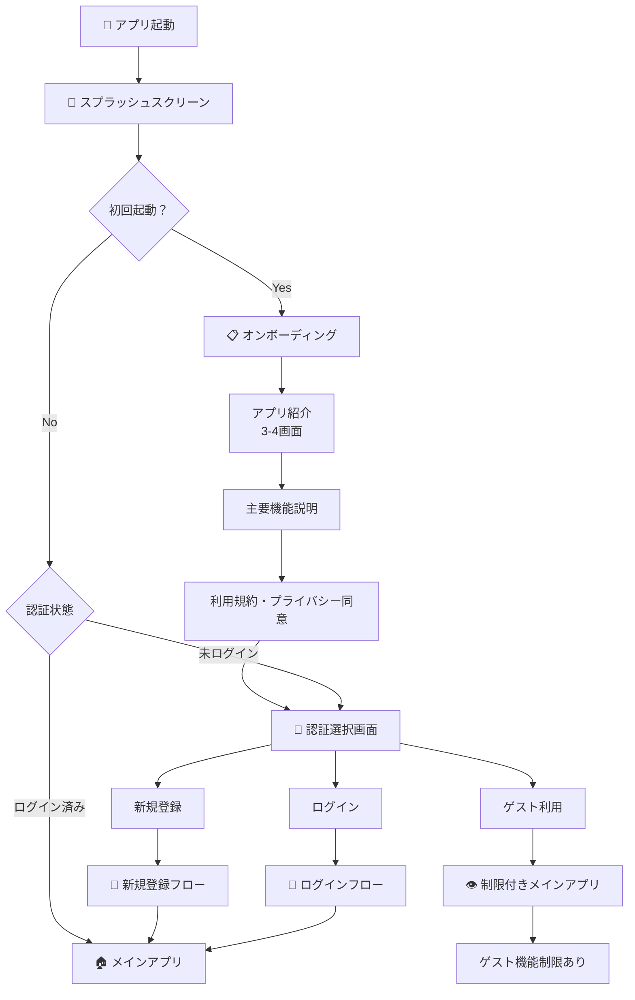
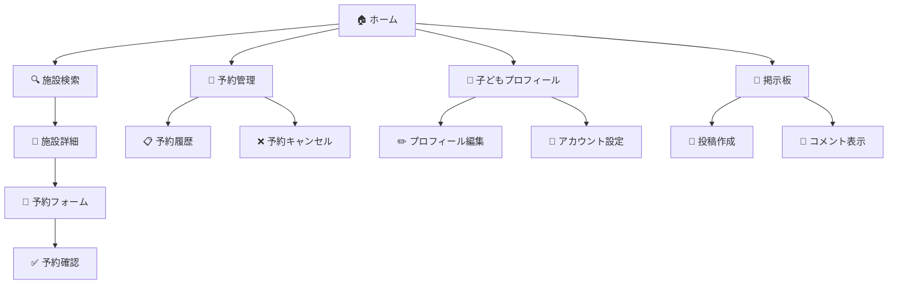

# UI/UXデザイン設計書

## 概要
本アプリケーションは、子育て世代の親向けの施設予約・コミュニティアプリケーションです。React Native（Expo）を使用して開発され、iOSとAndroidの両プラットフォームに対応しています。

## デザインコンセプト

### ビジョン
- **親しみやすさ**: 子育て世代の親が直感的に使えるシンプルで温かみのあるデザイン
- **効率性**: 忙しい親が素早く必要な情報にアクセスできる設計
- **信頼性**: 子供に関わるサービスとして、安心感を与えるインターフェース

### ターゲットユーザー
- 主に20代後半〜40代の子育て中の親
- スマートフォンの基本操作に慣れている
- 時間的制約が多く、効率的な操作を求める

## カラーパレット

| 色名 | HEX値 | 用途 |
|------|-------|------|
| Background (Ivory) | `#F9F6EE` | アプリ全体の背景色、温かみのあるアイボリー |
| Surface | `#FFFFFF` | カード、モーダルなどの表面色 |
| Accent | `#7AC6B8` | プライマリアクションボタン、選択状態 |
| Accent Soft | `#CDE9E3` | アクセントカラーの薄い版、背景色として使用 |
| Text Main | `#111827` | メインテキスト、見出し |
| Text Sub | `#6B7280` | サブテキスト、説明文 |
| Error | `#EF4444` | エラーメッセージ、警告 |
| Warning | `#F59E0B` | 注意喚起 |
| Success | `#10B981` | 成功メッセージ、完了状態 |

## タイポグラフィ

### フォントサイズ
- **見出し大**: 24px - ページタイトル
- **見出し中**: 18px - セクションタイトル
- **本文**: 16px - 通常のテキスト
- **補助テキスト**: 14px - 説明文、メタ情報
- **キャプション**: 12px - 小さな注釈

### フォントウェイト
- **Bold (700)**: 見出し、重要な情報
- **Semibold (600)**: サブ見出し、ボタンテキスト
- **Regular (400)**: 本文

## コンポーネントデザイン

### 1. ナビゲーション

#### ボトムナビゲーション
- 5つのタブアイコン（ホーム、予約、掲示板、プロフィール）
- アクティブ状態: アクセントカラー (#7AC6B8)
- 非アクティブ状態: グレー (#6B7280)
- アイコンサイズ: 24px

### 2. カード

#### 基本カードスタイル
```
- 背景色: #FFFFFF
- 角丸: 12px
- パディング: 16px
- シャドウ: 軽微な影 (elevation: 2)
```

#### 施設カード
- 画像: 縦横比 16:9、角丸上部
- 情報エリア: パディング 12px
- アクションボタン: 右下配置

#### 予約カード
- ステータスバッジ: 左上配置
- 日時情報: アイコン付き
- キャンセルボタン: 警告色使用

### 3. フォーム要素

#### 検索バー
- 背景色: Surface (#FFFFFF)
- 角丸: 24px
- 左側: 検索アイコン
- プレースホルダー: 薄いグレーテキスト

#### ボタン
**プライマリボタン**
- 背景色: Accent (#7AC6B8)
- テキスト色: 白
- 角丸: 8px
- パディング: 12px 24px

**セカンダリボタン**
- 背景色: 透明
- ボーダー: Accent 1px
- テキスト色: Accent

### 4. リスト

#### 施設リスト
- アイテム間隔: 12px
- 区切り線: なし（カードスタイル）
- タップフィードバック: 軽微なスケールアニメーション

## 画面設計

### 1. ホーム画面
- **構成要素**:
  - ユーザーへの挨拶
  - 検索バー
  - クイック予約バナー
  - 直近の予約カード
  - 近くの施設カルーセル

### 2. 予約画面
- **構成要素**:
  - 検索・フィルター機能
  - 地図表示エリア
  - 施設リスト（距離順）

### 3. 施設詳細画面
- **構成要素**:
  - ヒーローイメージ
  - 基本情報カード
  - タブナビゲーション（施設情報、メニュー、口コミ）
  - 予約ボタン（フローティング）

### 4. 掲示板画面
- **構成要素**:
  - カテゴリタブ
  - 投稿リスト
  - 新規投稿ボタン（フローティング）

### 5. プロフィール画面
- **構成要素**:
  - ユーザー情報カード
  - メニューリスト
  - ログアウトボタン

## インタラクション

### アニメーション
- **画面遷移**: スライドイン（300ms）
- **ボタンタップ**: スケール 0.95（100ms）
- **カード表示**: フェードイン（200ms）
- **リフレッシュ**: プルダウン

### フィードバック
- **タップ**: 即座の視覚的反応
- **読み込み中**: スピナー表示
- **エラー**: トーストメッセージ
- **成功**: チェックマークアニメーション

## レスポンシブデザイン

### ブレークポイント
- スマートフォン: 320px - 768px
- タブレット: 768px - 1024px

### 適応要素
- グリッドレイアウト: 画面幅に応じて列数調整
- フォントサイズ: 最小値設定で可読性確保
- タッチターゲット: 最小44px × 44px

## アクセシビリティ

### 基本原則
- **色のコントラスト**: WCAG AA基準準拠（4.5:1以上）
- **フォントサイズ**: 最小14px
- **タッチターゲット**: 最小44px
- **スクリーンリーダー**: 適切なラベル設定

### 実装項目
- アクセシビリティラベルの設定
- フォーカス順序の最適化
- 音声読み上げ対応
- 高コントラストモード対応

## パフォーマンス最適化

### 画像
- 遅延読み込み実装
- 適切な圧縮とフォーマット（WebP優先）
- サムネイル使用

### アニメーション
- 60fps維持
- GPU加速利用
- 不要なリレンダリング防止

## 今後の改善項目

1. **ダークモード対応**
   - システム設定連動
   - 手動切り替えオプション

2. **国際化（i18n）**
   - 多言語対応
   - RTL言語サポート

3. **マイクロインタラクション**
   - より豊かなフィードバック
   - デライトフルな体験

4. **パーソナライゼーション**
   - ユーザー設定の保存
   - カスタマイズ可能なテーマ

## 画面遷移フロー

### アプリ起動後の初回ユーザー体験



### 新規登録フロー詳細

```mermaid
graph TD
    A[📝 アカウント作成] --> B[メール・パスワード入力]
    A --> C[ソーシャルログイン選択]
    A --> D[SMS認証 (オプション)]
    
    B --> E[📧 認証メール送信]
    C --> E
    D --> E
    
    E --> F[👤 保護者情報入力]
    F --> F1[名前・電話番号]
    F1 --> F2[居住地域選択]
    F2 --> F3[緊急連絡先]
    
    F3 --> G[👶 子ども情報登録]
    G --> G1[名前・生年月日]
    G1 --> G2[アレルギー情報]
    G2 --> G3[医療情報・かかりつけ医]
    G3 --> G4[写真登録 (オプション)]
    
    G4 --> H[✅ 登録完了]
    H --> I[🏠 メインアプリへ]
```

### メインアプリ内の画面遷移



### 認証状態による画面制御

| 画面/機能 | ゲストユーザー | ログインユーザー |
|-----------|----------------|------------------|
| ホーム画面 | 閲覧のみ | 全機能利用可能 |
| 施設検索 | 基本情報のみ | 詳細情報・口コミ |
| 予約機能 | ❌ 利用不可 | ✅ 利用可能 |
| 掲示板 | 閲覧のみ | 投稿・コメント可能 |
| プロフィール | ❌ 利用不可 | ✅ 利用可能 |

### スプラッシュスクリーン設定

#### 推奨設定 (app.json)
```json
{
  "expo": {
    "splash": {
      "image": "./assets/images/splash.png",
      "resizeMode": "contain",
      "backgroundColor": "#F9F6EE"
    }
  }
}
```

#### デザイン要件
- **表示時間**: 1-3秒
- **背景色**: アプリのメインカラー (#F9F6EE)
- **ロゴ**: シンプルで読みやすい
- **アニメーション**: オプションでフェードイン効果

### 推奨ディレクトリ構造

```
app/
├── _layout.tsx                 # 認証状態管理・ルートレイアウト
├── (onboarding)/              # 初回起動時のオンボーディング
│   ├── _layout.tsx
│   ├── intro.tsx              # アプリ紹介画面
│   ├── features.tsx           # 機能説明画面
│   └── terms.tsx              # 利用規約・プライバシー
├── (auth)/                    # 認証関連画面
│   ├── _layout.tsx
│   ├── login.tsx              # ログイン
│   ├── register.tsx           # 新規登録
│   ├── parent-info.tsx        # 保護者情報入力
│   ├── child-info.tsx         # 子ども情報入力
│   └── forgot-password.tsx    # パスワードリセット
└── (tabs)/                    # 認証後のメインアプリ
    ├── index.tsx              # ホーム
    ├── reserve.tsx            # 予約
    ├── board.tsx              # 掲示板
    └── profile.tsx            # プロフィール
```

### 実装時の重要ポイント

1. **認証状態の永続化**: AsyncStorage使用
2. **画面遷移の滑らかさ**: Expo Routerの活用
3. **ユーザビリティ**: 戻るボタンの適切な処理
4. **エラーハンドリング**: ネットワークエラー時の適切な案内
5. **子育てアプリ特有の配慮**: 緊急時アクセスの考慮

## 更新履歴

| 日付 | バージョン | 変更内容 |
|------|-----------|----------|
| 2025-09-01 | 1.1.0 | 画面遷移フロー追加 |
| 2025-09-01 | 1.0.0 | 初版作成 |